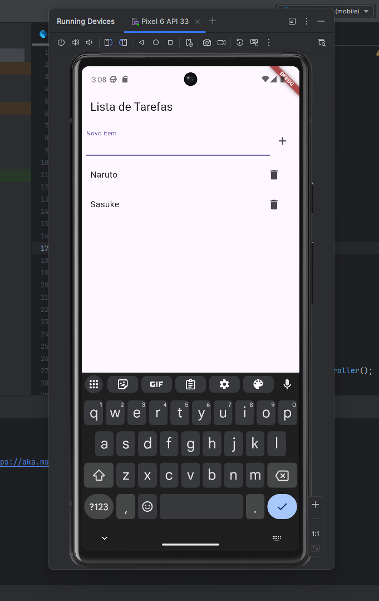

# 📝 To-Do List em Flutter

Este projeto é uma aplicação de **To-Do List** desenvolvida com **Flutter** e **Dart** no **Android Studio**. A aplicação permite gerenciar tarefas de forma simples e prática, explorando o desenvolvimento mobile multiplataforma com Flutter.

---

## 📸 Pré-visualização

  

---

## 🛠️ Tecnologias Utilizadas

- **Framework**: Flutter
- **Linguagem**: Dart
- **IDE**: Android Studio

---

## 🔍 Funcionalidades

- Adicionar e remover tarefas da lista.
- Marcar tarefas como concluídas.
- Interface intuitiva e responsiva para dispositivos móveis.

---

## Objetivo do Projeto

- Praticar o desenvolvimento de aplicações móveis com **Flutter**.
- Aprender a organizar e gerenciar o estado em Flutter usando Dart.
- Explorar o Android Studio como ambiente de desenvolvimento para projetos em Flutter.

---

📚 *Projeto desenvolvido para aprimorar habilidades com Flutter e Dart, criando uma aplicação funcional e intuitiva.*
